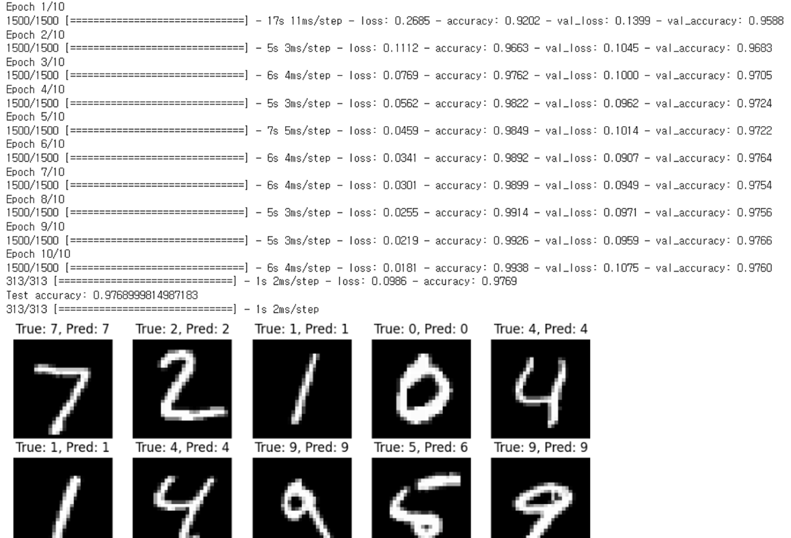

# 생성형 인공지능 입문

```python
import tensorflow as tf
from tensorflow.keras.datasets import mnist
from tensorflow.keras.models import Sequential
from tensorflow.keras.layers import Dense, Flatten
from tensorflow.keras.utils import to_categorical
import numpy as np
import matplotlib.pyplot as plt

# MNIST 데이터셋 불러오기
(train_images, train_labels), (test_images, test_labels) = mnist.load_data()

# 데이터 정규화: 픽셀 값을 0과 1 사이로 변환
train_images = train_images / 255.0
test_images = test_images / 255.0

# 레이블을 원-핫 인코딩으로 변환
train_labels = to_categorical(train_labels, 10)
test_labels = to_categorical(test_labels, 10)

# 모델 생성
mlp_model = Sequential([
    Flatten(input_shape=(28, 28)),  # 입력 데이터 평탄화
    Dense(128, activation='relu'),  # 첫 번째 은닉층
    Dense(64, activation='relu'),   # 두 번째 은닉층
    Dense(10, activation='softmax') # 출력층
])

# 모델 컴파일 설정
mlp_model.compile(optimizer='adam',
                  loss='categorical_crossentropy',
                  metrics=['accuracy'])

# 모델 학습
mlp_model.fit(train_images, train_labels, epochs=10, batch_size=32, validation_split=0.2)

# 모델 평가
loss, accuracy = mlp_model.evaluate(test_images, test_labels)
print('테스트 정확도:', accuracy)

# 예측 수행
predictions = mlp_model.predict(test_images)

# 예측 결과를 시각화하는 함수
def display_predictions(images, true_labels, predicted_labels, num_images=10):
    plt.figure(figsize=(10, 10))
    for i in range(num_images):
        plt.subplot(5, 5, i + 1)
        plt.imshow(images[i], cmap='gray')
        plt.title(f"실제: {np.argmax(true_labels[i])}, 예측: {np.argmax(predicted_labels[i])}")
        plt.axis('off')
    plt.show()

display_predictions(test_images, test_labels, predictions, num_images=10)
```

